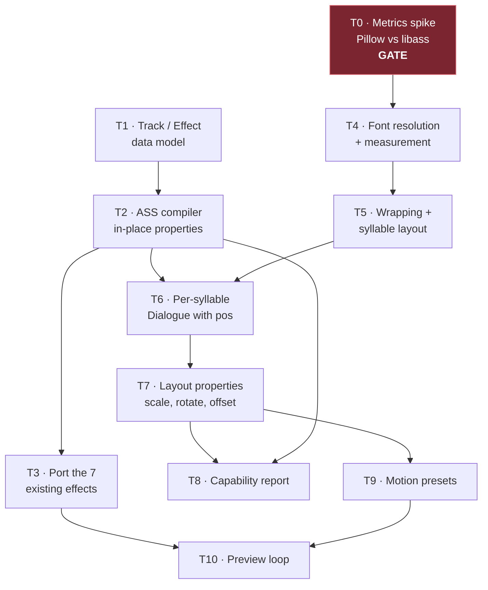

# Keyframe Effect Language Implementation Plan

> **For agentic workers:** REQUIRED SUB-SKILL: Use superpowers:subagent-driven-development (recommended) or superpowers:executing-plans to implement this plan task-by-task. Steps use checkbox (`- [ ]`) syntax for tracking.

**Goal:** Replace hand-written libass tag strings with an engine-neutral keyframe language, and give the ASS compiler per-syllable positioning so real motion (scale, rotation, fly-in) becomes expressible.

**Architecture:** An effect becomes data — `Effect(id, tracks)` where each `Track` animates one neutral property over keyframes. Two consumers are planned; only the ASS compiler is built here. The compiler emits `\t()` chains for properties libass supports in place, and switches to one Dialogue per syllable with `\pos` when a property needs real layout. A capability report names every property the compiler could not deliver, so a preset never ships looking different from its preview without saying so.

**Tech Stack:** Python 3.11+, Pillow (already installed, 12.3.0) for FreeType metrics, ffmpeg + libass for visual verification, pytest.

## Global Constraints

- The ASS path stays the default renderer. Render time stays in seconds, not minutes.
- **The sum of every `\k`/`\kf` duration in a line is the line's clock.** No task may change that total. `tests/test_s06_style_contracts.py::test_effect_choice_never_changes_total_karaoke_time` guards it and must stay green.
- `\t` and `\move` times are milliseconds **relative to the Dialogue line start**, never to the syllable. Every emitted time is an absolute line offset.
- No new runtime dependency. Pillow only; it is already present.
- Existing preset ids and rendered appearance must not change unless a task says so explicitly. `tests/test_karaoke_style_library.py` pins the id list.
- Every fence gets a negative control: sabotage the target, watch the test go red, restore. A test never seen red does not count as verified.
- Report counts with denominators (e.g. "538 of 538 syllables"), never bare numbers.
- Out of scope for this plan: the GPU compiler, colour tracks, `glow`, `gradient`, `motion_blur`, `audio` properties. They are named in the vocabulary check only so the compiler can refuse them loudly.

---

## Dependency Graph



**Two independent branches after T0/T1.** The *language* branch (T1→T2→T3) delivers working software on its own: the seven current effects become data with no visual change. The *layout* branch (T0→T4→T5→T6) is where the risk lives. T7 is the join. If T0 fails its gate, the layout branch changes shape and T7/T9 shrink to what in-place properties allow — the language branch still ships.

## File Structure

| File | Responsibility |
|---|---|
| `scripts/karaoke_styles/keyframes.py` *(new)* | `Track`, `Effect`, vocabulary validation, resolving keys to absolute line-relative milliseconds. No ASS knowledge. |
| `scripts/karaoke_styles/ass_compile.py` *(new)* | Keyframes → libass tags. Owns the property→tag table and the capability report. |
| `scripts/karaoke_styles/fonts.py` *(new)* | Style fontname/bold/italic → TTF path; text width measurement via Pillow. |
| `scripts/karaoke_styles/layout.py` *(new)* | Line wrapping and per-syllable x/y placement. Pure geometry, no ASS. |
| `scripts/karaoke_styles/effects.py` *(modify)* | `EFFECTS` becomes `dict[str, Effect]`. `syllable_ass` keeps its signature and delegates to `ass_compile`. |
| `scripts/s06_generate_ass.py` *(modify)* | Emits one Dialogue per line as today, or one per syllable when the effect needs layout. |
| `scripts/karaoke_styles/library.py` *(modify)* | New motion presets (T9). |
| `scripts/karaoke_styles/preview_effects.py` *(modify)* | Renders every effect from the registry, layout ones included (T10). |

---

### Task 0: Metrics spike — can Pillow place syllables where libass would?

This task is a **decision gate**, not a feature. Everything in the layout branch assumes we can measure text well enough to position syllables ourselves. Measure it before building on it.

The risk is specific: with `\pos` per syllable we own placement completely, so Pillow's numbers only need to be *self-consistent* — but a 3px error on "Ar" pushes "rasta" 3px off and the word looks broken. Intra-word error is what matters, not absolute width.

**Files:**
- Create: `scratch/spike_metrics.py` (throwaway, not committed)

**Interfaces:**
- Consumes: nothing.
- Produces: a go/no-go decision recorded in this plan file, plus the measured max intra-word error in pixels.

- [x] **Step 1: Write the spike**

```python
# scratch/spike_metrics.py
"""Does Pillow-measured syllable placement match what libass draws?

Renders one word two ways at 1920x1080:
  A) libass lays the word out itself (one Dialogue, no \pos)
  B) we place each syllable with \pos using Pillow advance widths
and reports the per-syllable x error in pixels.
"""
import subprocess
from pathlib import Path

import numpy as np
from PIL import Image, ImageFont

FONT = r"C:\Windows\Fonts\seguibl.ttf"   # Segoe UI Black
SIZE = 84                                 # 56px authored at 720p -> 84 at 1080p
WORD = "Arrastapracima"
SYLS = ["Ar", "ras", "ta", "pra", "ci", "ma"]
OUT = Path(__file__).parent

HEADER = (
    "[Script Info]\nScriptType: v4.00+\nPlayResX: 1920\nPlayResY: 1080\n"
    "ScaledBorderAndShadow: yes\n\n[V4+ Styles]\n"
    "Format: Name, Fontname, Fontsize, PrimaryColour, SecondaryColour, OutlineColour, "
    "BackColour, Bold, Italic, Underline, StrikeOut, ScaleX, ScaleY, Spacing, Angle, "
    "BorderStyle, Outline, Shadow, Alignment, MarginL, MarginR, MarginV, Encoding\n"
    f"Style: D,Segoe UI Black,{SIZE},&H00FFFFFF,&H00FFFFFF,&H00000000,&H00000000,"
    "-1,0,0,0,100,100,0,0,1,0,0,5,0,0,0,1\n\n[Events]\n"
    "Format: Layer, Start, End, Style, Name, MarginL, MarginR, MarginV, Effect, Text\n"
)


def advances():
    font = ImageFont.truetype(FONT, SIZE)
    widths, x = [], 0.0
    for i in range(len(SYLS)):
        prefix = "".join(SYLS[:i])
        widths.append(font.getlength(prefix))
    total = font.getlength(WORD)
    return widths, total


def render(name: str, text: str):
    (OUT / f"{name}.ass").write_text(
        HEADER + f"Dialogue: 0,0:00:00.00,0:00:02.00,D,,0,0,0,,{text}\n",
        encoding="utf-8-sig",
    )
    subprocess.run(
        ["ffmpeg", "-y", "-loglevel", "error", "-f", "lavfi", "-t", "1",
         "-i", "color=c=black:s=1920x1080:r=10", "-vf", f"ass={name}.ass",
         "-frames:v", "1", f"{name}.png"],
        cwd=OUT, check=True,
    )
    a = np.array(Image.open(OUT / f"{name}.png").convert("L"))
    cols = np.where(a.max(axis=0) > 40)[0]
    return a, int(cols[0]), int(cols[-1])


def main():
    offsets, total = advances()
    # A: libass lays it out, anchored centre (\an5) at frame centre.
    _, a_left, a_right = render("spike_a", WORD)
    # B: we place each syllable ourselves, left edge matched to A's left edge.
    parts = []
    for syl, off in zip(SYLS, offsets):
        # \an4 = left-middle anchor, so x IS the syllable's left edge.
        parts.append(f"{{\\an4\\pos({a_left + off:.1f},540)}}{syl}")
    _, b_left, b_right = render("spike_b", "".join(
        f"{p}\\N" if False else p for p in parts))
    print(f"pillow total advance : {total:.1f}px")
    print(f"libass drawn width   : {a_right - a_left}px")
    print(f"width error          : {abs(total - (a_right - a_left)):.1f}px")
    print(f"per-syllable offsets : {[round(o, 1) for o in offsets]}")


if __name__ == "__main__":
    main()
```

- [x] **Step 2: Run the spike and read the numbers**

Run: `python scratch/spike_metrics.py`

Note: a single Dialogue cannot hold several `\pos` tags — only the first wins. Emit **one Dialogue per syllable** for variant B instead; edit `render` to take a list of event lines. Fix this while running the spike; it is the same constraint T6 lives under.

- [x] **Step 3: Record the gate decision in this file**

Write the measured `width error` into the table below and pick a branch.

| Measured intra-word error | Decision |
|---|---|
| ≤ 2px | **Go.** Build T4–T7 as written: position per syllable. |
| 3–6px | **Go, degraded.** Position per **word**, and let libass lay out syllables inside the word. T7 loses per-syllable `offset_x`; scale/rotate become per-word. Update T5/T7 before starting them. |
| > 6px | **No-go.** Drop the layout branch. T7/T9 ship with in-place properties only (`scale_y`, `alpha`, `blur`, `outline`), and per-word motion waits for the GPU compiler. |

#### GATE RESULT (2026-08-17): **GO** — max intra-word error **1px**, mean 0.30px

**Measured:** 30 of 30 syllable placements — 2 faces (Segoe UI Bold, Segoe UI
Black) × 3 words (`Arrastapracima` 6 syl, `Vocêtambém` 4 syl, `Toqueiaporta`
5 syl), ASS `Fontsize 84` at 1920×1080. 0 of 30 placements exceeded 2px.

**The spike as drafted measured the wrong thing** and had to be rebuilt. It
compared the whole word's ink width, which reports side bearings rather than
where syllable 3 lands, and — as the plan warned — put several `\pos` tags in
one Dialogue. What it now measures per syllable *i*:

- **A_i** — the whole word in one Dialogue, every syllable but *i* hidden with
  `\alpha&HFF&`. Alpha does not move the pen, so the visible glyph sits exactly
  where libass's own layout puts it.
- **C_i** — syllable *i* alone at `\pos(X0)`. `A_i.left − C_i.left` is libass's
  true advance for the prefix, with the glyph's left side bearing cancelling
  exactly. This is a measurement of libass, not a formula guessed at it.
- **B_i** — syllable *i* alone at `\pos(X0 + our_advance)`. `|A_i.left −
  B_i.left|` is the error the gate is about.

**Two real bugs the gate caught, and they are both production findings, not
spike trivia.** They are why `measure()` in T4 cannot be written as the plan
drafts it:

1. **An ASS `Fontsize` is not an em size.** libass sizes a face so that
   ascender + descender equals `Fontsize`; `ImageFont.truetype(path, S)` treats
   `S` as the em size. For Segoe UI that is a flat **0.75184×**, and the first
   run reported a 129px "metrics error" that was one scale factor applied 30
   times. The correct size is

   ```python
   px = ass_fontsize * REF_PPEM / sum(ImageFont.truetype(ttf, REF_PPEM).getmetrics())
   ```

   which reproduces `upem / (hhea_ascender − hhea_descender)` = 2048 / 2724 for
   both faces, without parsing font tables.

2. **Read that ratio, and every advance, at a high reference ppem.**
   `getmetrics()` rounds ascent and descent to whole pixels, and FreeType
   hinting quantises each glyph advance at the target ppem. Both errors are
   systematic and accumulate along the word: at 84ppem they were worth 5px by
   the last syllable. Measure at `REF_PPEM = 1024` and scale linearly.

With both fixed, a least-squares fit of libass's measured advances against ours
lands at **0.9958 (Segoe UI Bold)** and **0.9980 (Segoe UI Black)** — both
within the ±0.5px ink-column noise of 1.0, so the factor is derivable from the
font and needs no per-face calibration.

**Negative control.** Not fabricated: the harness was seen red twice, on real
defects — 129px with the em-size reading, 4px with the quantised ppem — and
green at 1px once the size mapping was right. It discriminates.

**Consequences for later tasks (binding):**
- **T4** must use the derivation above. The drafted `measure()` uses
  `size_px = round(style.fontsize * scale)` directly as the Pillow size, which
  is 33% too large. The drafted T4 tests do not catch this — additivity and
  monotonicity are both scale-invariant — so T4 gains a test that pins the
  absolute scale against a known advance.
- **T6** must pass the ASS `Fontsize` to `measure()`, not a pixel size it has
  already converted.
- Presets name `fontname="Segoe UI Bold"`, which is a family+subfamily pair and
  not a family. The T4 resolver as drafted matches families exactly and would
  raise `FontNotFound` on every shipped preset; the T4 test only exercises
  `"Segoe UI Black"`, which *is* a real family, so it would have passed anyway.
  T4 must strip trailing style words and gains a test for it.

Spike: `scratch/spike_metrics.py`, throwaway, not committed.

- [x] **Step 4: Commit the decision**

The spike script is throwaway and stays out of git. Commit only this plan file.

```bash
git add docs/superpowers/plans/2026-08-17-keyframe-effect-language.md
git commit -m "docs: record font-metrics gate decision for the keyframe effect language"
```

---

### Task 1: Track and Effect data model

**Files:**
- Create: `scripts/karaoke_styles/keyframes.py`
- Test: `tests/test_keyframes.py`

**Interfaces:**
- Consumes: nothing.
- Produces:
  - `Track(prop: str, keys: tuple[tuple[float, float], ...], time: str = "ms", accel: float = 1.0)`
  - `Effect(id: str, tracks: tuple[Track, ...])`
  - `IN_PLACE_PROPS: frozenset[str]`, `LAYOUT_PROPS: frozenset[str]`, `FUTURE_PROPS: frozenset[str]`, `ALL_PROPS: frozenset[str]`
  - `resolve(track: Track, *, attack_ms: int, duration_ms: int) -> list[tuple[int, float]]` — keys as absolute line-relative milliseconds, sorted, duplicates at the same time collapsed keeping the last.
  - `Effect.needs_layout -> bool` — true when any track animates a `LAYOUT_PROPS` property.

- [ ] **Step 1: Write the failing test**

```python
# tests/test_keyframes.py
"""Contract tests for the engine-neutral keyframe model."""

import unittest

from scripts.karaoke_styles.keyframes import (
    FUTURE_PROPS,
    Effect,
    Track,
    resolve,
)


class TrackResolutionTests(unittest.TestCase):
    def test_ms_keys_are_offset_by_the_syllable_attack(self):
        track = Track("scale_y", ((0, 1.0), (90, 1.24), (240, 1.0)))
        self.assertEqual(
            [(800, 1.0), (890, 1.24), (1040, 1.0)],
            resolve(track, attack_ms=800, duration_ms=400),
        )

    def test_frac_keys_scale_with_the_syllable_duration(self):
        track = Track("blur", ((0.0, 3.0), (1.0, 0.0)), time="frac")
        self.assertEqual(
            [(800, 3.0), (1200, 0.0)],
            resolve(track, attack_ms=800, duration_ms=400),
        )

    def test_negative_time_lands_before_the_attack(self):
        # "the word flies in 300ms before it is sung"
        track = Track("offset_y", ((-300, -80.0), (0, 0.0)))
        self.assertEqual(
            [(500, -80.0), (800, 0.0)],
            resolve(track, attack_ms=800, duration_ms=400),
        )

    def test_resolved_time_never_goes_negative(self):
        # A lead-in longer than the line's own head would ask libass to animate
        # before the Dialogue exists; \t clamps silently, so clamp explicitly.
        track = Track("alpha", ((-500, 0.0), (0, 1.0)))
        self.assertEqual([(0, 0.0), (200, 1.0)], resolve(track, attack_ms=200, duration_ms=400))


class VocabularyTests(unittest.TestCase):
    def test_unknown_property_is_rejected_at_definition_time(self):
        with self.assertRaises(ValueError) as caught:
            Track("wobble", ((0, 1.0),))
        self.assertIn("wobble", str(caught.exception))

    def test_future_property_is_accepted_but_flagged(self):
        # glow/gradient/motion_blur/audio belong to the vocabulary so the ASS
        # compiler can refuse them by name instead of ignoring them.
        for prop in FUTURE_PROPS:
            with self.subTest(prop=prop):
                self.assertEqual(prop, Track(prop, ((0, 1.0),)).prop)
        self.assertEqual(4, len(FUTURE_PROPS))

    def test_track_needs_at_least_one_key(self):
        with self.assertRaises(ValueError):
            Track("alpha", ())

    def test_time_mode_must_be_ms_or_frac(self):
        with self.assertRaises(ValueError):
            Track("alpha", ((0, 1.0),), time="seconds")


class EffectTests(unittest.TestCase):
    def test_effect_needs_layout_only_for_layout_properties(self):
        in_place = Effect("a", (Track("scale_y", ((0, 1.0), (90, 1.2))),))
        moving = Effect("b", (Track("offset_x", ((0, -40.0), (120, 0.0))),))
        self.assertFalse(in_place.needs_layout)
        self.assertTrue(moving.needs_layout)


if __name__ == "__main__":
    unittest.main()
```

- [ ] **Step 2: Run test to verify it fails**

Run: `python -m pytest tests/test_keyframes.py -v`
Expected: FAIL — `ModuleNotFoundError: No module named 'scripts.karaoke_styles.keyframes'`

- [ ] **Step 3: Write minimal implementation**

```python
# scripts/karaoke_styles/keyframes.py
r"""Engine-neutral keyframe model for karaoke syllable effects.

An effect is DATA, not a tag string: a set of tracks, each animating one
neutral property over keyframes. Nothing here knows about ASS. The ASS
compiler lives in ass_compile.py; a GPU compiler can read the same tracks.

Time reference: every key is stated relative to the SYLLABLE's attack, which
is the natural way to author. resolve() converts to absolute line-relative
milliseconds, because that is the only clock \t and \move actually run on.
"""

from __future__ import annotations

from dataclasses import dataclass

# Properties libass can animate on a syllable without owning its position.
IN_PLACE_PROPS = frozenset({"scale_y", "alpha", "blur", "outline"})
# Properties that need us to place the syllable ourselves (one Dialogue each
# with \pos), because they change the glyph's advance or its origin.
LAYOUT_PROPS = frozenset({"scale", "scale_x", "rotate", "offset_x", "offset_y"})
# Named on purpose so the ASS compiler can refuse them by name rather than
# ignore them. Delivered by the GPU compiler, which is not part of this plan.
FUTURE_PROPS = frozenset({"glow", "gradient", "motion_blur", "audio"})
ALL_PROPS = IN_PLACE_PROPS | LAYOUT_PROPS | FUTURE_PROPS

TIME_MODES = ("ms", "frac")


@dataclass(frozen=True)
class Track:
    prop: str
    keys: tuple[tuple[float, float], ...]
    time: str = "ms"
    accel: float = 1.0

    def __post_init__(self) -> None:
        if self.prop not in ALL_PROPS:
            raise ValueError(
                f"unknown effect property: {self.prop!r} "
                f"(known: {', '.join(sorted(ALL_PROPS))})"
            )
        if not self.keys:
            raise ValueError(f"track {self.prop!r} has no keys")
        if self.time not in TIME_MODES:
            raise ValueError(
                f"track {self.prop!r} has time={self.time!r}, expected one of {TIME_MODES}"
            )


@dataclass(frozen=True)
class Effect:
    id: str
    tracks: tuple[Track, ...]

    @property
    def needs_layout(self) -> bool:
        return any(track.prop in LAYOUT_PROPS for track in self.tracks)

    def props(self) -> set[str]:
        return {track.prop for track in self.tracks}


def resolve(track: Track, *, attack_ms: int, duration_ms: int) -> list[tuple[int, float]]:
    r"""Keys as (absolute_ms_from_line_start, value), sorted and de-duplicated.

    Clamped at 0: a lead-in longer than the line's own head would ask libass to
    animate before the Dialogue exists.
    """
    scale = duration_ms if track.time == "frac" else 1
    resolved: dict[int, float] = {}
    for at, value in track.keys:
        ms = max(0, int(round(attack_ms + at * scale)))
        resolved[ms] = float(value)
    return sorted(resolved.items())
```

- [ ] **Step 4: Run test to verify it passes**

Run: `python -m pytest tests/test_keyframes.py -v`
Expected: PASS, 8 tests.

- [ ] **Step 5: Negative control**

Change `max(0, int(round(...)))` to `int(round(...))` in `resolve`. Run
`python -m pytest tests/test_keyframes.py -v`. Expected: `test_resolved_time_never_goes_negative` FAILS with `[(-300, 0.0), (200, 1.0)] != [(0, 0.0), (200, 1.0)]`. Restore the clamp and confirm green again.

- [ ] **Step 6: Commit**

```bash
git add scripts/karaoke_styles/keyframes.py tests/test_keyframes.py
git commit -m "feat(effects): engine-neutral keyframe model for syllable effects"
```

---

### Task 2: ASS compiler for in-place properties

**Files:**
- Create: `scripts/karaoke_styles/ass_compile.py`
- Test: `tests/test_ass_compile.py`

**Interfaces:**
- Consumes: `Track`, `Effect`, `resolve`, `IN_PLACE_PROPS`, `LAYOUT_PROPS`, `FUTURE_PROPS` from Task 1.
- Produces:
  - `compile_syllable(effect: Effect, *, text: str, duration_cs: int, attack_ms: int) -> str` — the `{tags}text` token, same shape `s06` already splices into a line.
  - `unsupported_props(effect: Effect) -> set[str]` — properties this compiler cannot deliver.
  - `PROP_TAG: dict[str, callable]` — the property→tag table.

- [ ] **Step 1: Write the failing test**

```python
# tests/test_ass_compile.py
r"""The keyframe -> libass tag compiler.

Every emitted \t time is absolute from the DIALOGUE LINE start, because that
is the clock libass runs \t on. A compiler that anchors at 0 animates every
syllable of the line simultaneously on the first frame.
"""

import unittest

from scripts.karaoke_styles.ass_compile import (
    compile_syllable,
    unsupported_props,
)
from scripts.karaoke_styles.keyframes import Effect, Track


class CompileSyllableTests(unittest.TestCase):
    def test_first_key_becomes_a_static_tag_and_the_rest_become_transforms(self):
        effect = Effect("pop", (Track("scale_y", ((0, 1.0), (90, 1.24), (240, 1.0))),))
        out = compile_syllable(effect, text="ta", duration_cs=40, attack_ms=800)
        self.assertEqual(
            r"{\fscy100\t(800,890,\fscy124)\t(890,1040,\fscy100)\kf40}ta", out
        )

    def test_alpha_is_inverted_into_ass_transparency(self):
        # neutral 0.0 = invisible, 1.0 = opaque; ASS &HFF& = invisible.
        effect = Effect("reveal", (Track("alpha", ((0, 0.0), (140, 1.0))),))
        out = compile_syllable(effect, text="x", duration_cs=20, attack_ms=0)
        self.assertEqual(r"{\alpha&HFF&\t(0,140,\alpha&H00&)\kf20}x", out)

    def test_accel_is_written_when_it_is_not_linear(self):
        effect = Effect("e", (Track("blur", ((0, 4.0), (200, 0.0)), accel=0.5),))
        out = compile_syllable(effect, text="x", duration_cs=20, attack_ms=100)
        self.assertIn(r"\t(100,300,0.5,\blur0)", out)

    def test_a_single_key_emits_no_transform_at_all(self):
        effect = Effect("e", (Track("outline", ((0, 6.0),)),))
        out = compile_syllable(effect, text="x", duration_cs=20, attack_ms=0)
        self.assertEqual(r"{\bord6\kf20}x", out)
        self.assertNotIn(r"\t(", out)

    def test_zero_length_interval_is_skipped(self):
        # Two keys at the same resolved millisecond would emit \t(500,500,...),
        # which libass treats as an instant jump and is noise in the output.
        effect = Effect("e", (Track("alpha", ((0, 0.0), (0, 1.0), (100, 1.0))),))
        out = compile_syllable(effect, text="x", duration_cs=20, attack_ms=500)
        self.assertNotIn("(500,500", out)

    def test_effect_with_no_tracks_is_the_plain_sweep(self):
        out = compile_syllable(Effect("highlight", ()), text="x", duration_cs=20, attack_ms=0)
        self.assertEqual(r"{\kf20}x", out)

    def test_duration_is_floored_to_one_centisecond(self):
        out = compile_syllable(Effect("e", ()), text="x", duration_cs=0, attack_ms=0)
        self.assertEqual(r"{\kf1}x", out)


class CapabilityTests(unittest.TestCase):
    def test_future_properties_are_reported_not_dropped(self):
        effect = Effect("cine", (
            Track("scale_y", ((0, 1.0), (90, 1.2))),
            Track("glow", ((0, 0.0), (90, 1.0))),
            Track("gradient", ((0, 0.0),)),
        ))
        self.assertEqual({"glow", "gradient"}, unsupported_props(effect))

    def test_a_fully_supported_effect_reports_nothing(self):
        effect = Effect("pop", (Track("scale_y", ((0, 1.0), (90, 1.2))),))
        self.assertEqual(set(), unsupported_props(effect))

    def test_unsupported_property_emits_no_tag(self):
        effect = Effect("cine", (Track("glow", ((0, 0.0), (90, 1.0))),))
        out = compile_syllable(effect, text="x", duration_cs=20, attack_ms=0)
        self.assertEqual(r"{\kf20}x", out)


if __name__ == "__main__":
    unittest.main()
```

- [ ] **Step 2: Run test to verify it fails**

Run: `python -m pytest tests/test_ass_compile.py -v`
Expected: FAIL — `ModuleNotFoundError: No module named 'scripts.karaoke_styles.ass_compile'`

- [ ] **Step 3: Write minimal implementation**

```python
# scripts/karaoke_styles/ass_compile.py
r"""Keyframe tracks -> libass override tags.

The one rule that governs this file: \t times are milliseconds from the START
OF THE DIALOGUE LINE, not from the syllable. Callers pass attack_ms already
measured from the line start, and keyframes.resolve() keeps it that way.

Only IN_PLACE_PROPS are compiled here. LAYOUT_PROPS need the syllable's own
\pos and are handled by the layout path; FUTURE_PROPS are refused by name
through unsupported_props(), never silently ignored.
"""

from __future__ import annotations

from .keyframes import IN_PLACE_PROPS, Effect, resolve


def _fmt(value: float) -> str:
    """Trim a float to the shortest form libass parses the same way."""
    if value == int(value):
        return str(int(value))
    return f"{value:g}"


def _alpha_tag(value: float) -> str:
    # Neutral 1.0 = fully visible; ASS alpha is transparency, so invert.
    visible = min(1.0, max(0.0, value))
    return f"\\alpha&H{255 - round(visible * 255):02X}&"


PROP_TAG = {
    "scale_y": lambda v: f"\\fscy{_fmt(v * 100)}",
    "alpha": _alpha_tag,
    "blur": lambda v: f"\\blur{_fmt(v)}",
    "outline": lambda v: f"\\bord{_fmt(v)}",
}

ASS_SUPPORTED = frozenset(PROP_TAG)
assert ASS_SUPPORTED == IN_PLACE_PROPS, "PROP_TAG and IN_PLACE_PROPS drifted apart"


def unsupported_props(effect: Effect) -> set[str]:
    """Properties this effect asks for that the ASS compiler cannot deliver."""
    return {t.prop for t in effect.tracks} - ASS_SUPPORTED


def compile_syllable(
    effect: Effect,
    *,
    text: str,
    duration_cs: int,
    attack_ms: int,
) -> str:
    r"""Render one syllable as "{tags}text".

    duration_cs is the syllable's karaoke time and is emitted verbatim as \kf:
    the sum of these across a line is the line's clock and must not change.
    """
    duration_cs = max(1, int(duration_cs))
    duration_ms = duration_cs * 10
    statics: list[str] = []
    transforms: list[str] = []

    for track in effect.tracks:
        if track.prop not in ASS_SUPPORTED:
            continue
        tag = PROP_TAG[track.prop]
        keys = resolve(track, attack_ms=attack_ms, duration_ms=duration_ms)
        statics.append(tag(keys[0][1]))
        for (t0, _), (t1, v1) in zip(keys, keys[1:]):
            if t1 <= t0:
                continue
            accel = "" if track.accel == 1.0 else f"{_fmt(track.accel)},"
            transforms.append(f"\\t({t0},{t1},{accel}{tag(v1)})")

    return f"{{{''.join(statics)}{''.join(transforms)}\\kf{duration_cs}}}{text}"
```

- [ ] **Step 4: Run test to verify it passes**

Run: `python -m pytest tests/test_ass_compile.py -v`
Expected: PASS, 10 tests.

- [ ] **Step 5: Negative control on the anchoring rule**

In `compile_syllable`, change `resolve(track, attack_ms=attack_ms, ...)` to `resolve(track, attack_ms=0, ...)`. Run `python -m pytest tests/test_ass_compile.py -v`. Expected: `test_first_key_becomes_a_static_tag_and_the_rest_become_transforms` FAILS showing `\t(0,90,...)` instead of `\t(800,890,...)`. Restore and confirm green.

- [ ] **Step 6: Commit**

```bash
git add scripts/karaoke_styles/ass_compile.py tests/test_ass_compile.py
git commit -m "feat(effects): compile keyframe tracks to libass transform tags"
```

---

### Task 3: Port the seven existing effects to the language

The visible output must not change. `typewriter` is the exception and keeps its
own function, because splitting a syllable across characters is a *text*
operation, not a property animation — the keyframe model has no vocabulary for
it and inventing one for a single effect would be speculative.

**Files:**
- Modify: `scripts/karaoke_styles/effects.py`
- Test: `tests/test_effect_port_regression.py` *(new)*

**Interfaces:**
- Consumes: `Effect`, `Track` (T1); `compile_syllable`, `unsupported_props` (T2).
- Produces: `EFFECTS: dict[str, Effect | TextEffect]`; `syllable_ass(...)` keeps its exact current signature `(effect, duration_cs, text, *, offset_ms=0, style_effect=DEFAULT_EFFECT) -> str`.

- [ ] **Step 1: Capture the current output as a golden file**

Run this before touching `effects.py`:

```bash
python - <<'EOF'
import json, sys
sys.path.insert(0, ".")
from scripts.karaoke_styles.effects import EFFECTS, syllable_ass
golden = {}
for name in sorted(EFFECTS):
    golden[name] = [
        syllable_ass(name, cs, txt, offset_ms=off)
        for cs, txt, off in ((40, "ta", 800), (7, "a", 0), (3, "aaa", 1234), (100, "lá", 55))
    ]
json.dump(golden, open("tests/golden/effect_tokens.json", "w", encoding="utf-8"),
          ensure_ascii=False, indent=2)
print(f"{len(golden)} effects captured")
EOF
```

Expected: `7 effects captured`.

- [ ] **Step 2: Write the failing test**

```python
# tests/test_effect_port_regression.py
"""The port to keyframes must not change a single emitted token.

Golden captured from the pre-port implementation. flash/focus/pop/reveal are
expected to match byte for byte; highlight/none/typewriter are unchanged code
paths and are in here as controls.
"""

import json
import unittest
from pathlib import Path

from scripts.karaoke_styles.effects import EFFECTS, syllable_ass

GOLDEN = json.loads(
    (Path(__file__).parent / "golden" / "effect_tokens.json").read_text(encoding="utf-8")
)
CASES = ((40, "ta", 800), (7, "a", 0), (3, "aaa", 1234), (100, "lá", 55))


class EffectPortRegressionTests(unittest.TestCase):
    def test_every_golden_effect_still_exists(self):
        self.assertEqual(7, len(GOLDEN))
        self.assertEqual(sorted(GOLDEN), sorted(EFFECTS))

    def test_tokens_are_unchanged_by_the_port(self):
        for name, expected in GOLDEN.items():
            for (cs, txt, off), want in zip(CASES, expected):
                with self.subTest(effect=name, text=txt, offset=off):
                    self.assertEqual(want, syllable_ass(name, cs, txt, offset_ms=off))


if __name__ == "__main__":
    unittest.main()
```

- [ ] **Step 3: Run it — it must PASS before the port**

Run: `python -m pytest tests/test_effect_port_regression.py -v`
Expected: PASS. This is the control: the golden matches the implementation it was captured from. If it fails now, the capture is wrong — fix that before continuing.

- [ ] **Step 4: Rewrite `effects.py` over the language**

Replace the effect function bodies. `_sweep` becomes an empty-track effect, and the ordering of static tags must reproduce the golden exactly — `\be1` before the transforms in the ported effects.

```python
# scripts/karaoke_styles/effects.py  — replacing the effect definitions
from __future__ import annotations

from dataclasses import dataclass
from typing import Callable

from .ass_compile import compile_syllable, unsupported_props  # noqa: F401
from .keyframes import Effect, Track

DEFAULT_EFFECT = "highlight"

# The soft edge every lyric effect carries. Kept as a literal prefix rather than
# a track: \be is a render-quality switch, not something anyone animates.
SOFT_EDGE = "\\be1"


@dataclass(frozen=True)
class TextEffect:
    r"""An effect that rewrites the syllable's TEXT, not just its properties.

    typewriter is the only one: it splits a syllable across its characters and
    divides the karaoke time between them. The keyframe model animates
    properties of a fixed token and cannot express that, so this stays a
    function. needs_layout is always False.
    """

    id: str
    render: Callable[[int, str, int], str]
    needs_layout: bool = False

    def props(self) -> set[str]:
        return set()


EFFECTS: dict[str, Effect | TextEffect] = {
    "highlight": Effect("highlight", ()),
    "none": Effect("none", ()),
    "flash": Effect("flash", (Track("outline", ((0, 8.0), (200, 2.0))),)),
    "focus": Effect("focus", (Track("blur", ((0.0, 3.0), (1.0, 0.0)), time="frac"),)),
    "pop": Effect("pop", (Track("scale_y", ((0, 1.0), (90, 1.24), (240, 1.0))),)),
    "reveal": Effect("reveal", (Track("alpha", ((0, 0.0), (140, 1.0))),)),
    "typewriter": TextEffect("typewriter", _typewriter),
}
```

`syllable_ass` becomes the dispatcher. Two literal details keep the golden byte-identical: `none` emits `\k` not `\kf`, and every other effect carries `SOFT_EDGE` immediately before the karaoke tag.

```python
def syllable_ass(
    effect: str,
    duration_cs: int,
    text: str,
    *,
    offset_ms: int = 0,
    style_effect: str = DEFAULT_EFFECT,
) -> str:
    name = effect if effect in EFFECTS else DEFAULT_EFFECT
    if name == DEFAULT_EFFECT and style_effect in EFFECTS:
        name = style_effect
    chosen = EFFECTS[name]
    if isinstance(chosen, TextEffect):
        return chosen.render(max(1, int(duration_cs)), text, max(0, int(offset_ms)))
    token = compile_syllable(
        chosen,
        text=text,
        duration_cs=duration_cs,
        attack_ms=max(0, int(offset_ms)),
    )
    if name == "none":
        return token.replace("\\kf", "\\k", 1)
    return token.replace("\\kf", f"{SOFT_EDGE}\\kf", 1)
```

- [ ] **Step 5: Run the regression and the whole suite**

Run: `python -m pytest tests/test_effect_port_regression.py tests/ -q`
Expected: PASS — 626 existing tests plus the new ones, zero failures. Any diff in the golden is a real behaviour change: fix the port, do not edit the golden.

- [ ] **Step 6: Commit**

```bash
git add scripts/karaoke_styles/effects.py tests/test_effect_port_regression.py tests/golden/effect_tokens.json
git commit -m "refactor(effects): define the shipped effects as keyframe data"
```

---

### Task 4: Font resolution and measurement

**Gated by Task 0.** Do not start until the gate decision is recorded.

**Files:**
- Create: `scripts/karaoke_styles/fonts.py`
- Test: `tests/test_fonts.py`

**Interfaces:**
- Consumes: `KaraokeStyle` from `library.py` (fields `fontname`, `bold`, `italic`, `fontsize`).
- Produces:
  - `resolve_font_path(fontname: str, *, bold: bool, italic: bool) -> Path` — raises `FontNotFound` when nothing matches.
  - `measure(text: str, *, font_path: Path, size_px: int, spacing: float = 0.0) -> float` — advance width in pixels.
  - `class FontNotFound(RuntimeError)`

- [ ] **Step 1: Write the failing test**

```python
# tests/test_fonts.py
"""Font file resolution and text measurement.

Skipped wholesale off Windows: the resolver reads the system font directory,
and the pipeline's presets name Windows faces.
"""

import sys
import unittest
from pathlib import Path

from tests._optional_imports import import_or_skip

import_or_skip("PIL")

from scripts.karaoke_styles.fonts import FontNotFound, measure, resolve_font_path


@unittest.skipUnless(sys.platform == "win32", "resolver reads the Windows font dir")
class FontResolutionTests(unittest.TestCase):
    def test_resolves_a_face_the_presets_actually_use(self):
        path = resolve_font_path("Segoe UI Black", bold=True, italic=False)
        self.assertTrue(path.exists())
        self.assertEqual(".ttf", path.suffix.lower())

    def test_unknown_family_raises_instead_of_substituting(self):
        # libass substitutes silently; that is exactly the surprise we refuse
        # to inherit, because a substituted face invalidates every measurement.
        with self.assertRaises(FontNotFound):
            resolve_font_path("Definitely Not A Font", bold=False, italic=False)


@unittest.skipUnless(sys.platform == "win32", "needs a real font file")
class MeasurementTests(unittest.TestCase):
    def setUp(self):
        self.path = resolve_font_path("Segoe UI Black", bold=True, italic=False)

    def test_width_grows_with_text_length(self):
        short = measure("Ar", font_path=self.path, size_px=84)
        longer = measure("Arrasta", font_path=self.path, size_px=84)
        self.assertGreater(longer, short)

    def test_concatenation_is_additive_within_two_pixels(self):
        # The property the layout depends on: placing "ras" at the advance of
        # "Ar" must land where measuring "Arras" says it should.
        parts = sum(measure(s, font_path=self.path, size_px=84) for s in ("Ar", "ras"))
        whole = measure("Arras", font_path=self.path, size_px=84)
        self.assertLess(abs(parts - whole), 2.0, f"{parts} vs {whole}")

    def test_empty_text_measures_zero(self):
        self.assertEqual(0.0, measure("", font_path=self.path, size_px=84))

    def test_spacing_adds_one_gap_per_character(self):
        plain = measure("abc", font_path=self.path, size_px=84)
        spaced = measure("abc", font_path=self.path, size_px=84, spacing=5.0)
        self.assertAlmostEqual(plain + 15.0, spaced, places=3)


if __name__ == "__main__":
    unittest.main()
```

- [ ] **Step 2: Run test to verify it fails**

Run: `python -m pytest tests/test_fonts.py -v`
Expected: FAIL — `ModuleNotFoundError: No module named 'scripts.karaoke_styles.fonts'`

- [ ] **Step 3: Write minimal implementation**

```python
# scripts/karaoke_styles/fonts.py
r"""Font file lookup and text measurement for the layout path.

libass substitutes a missing family silently. We refuse to: once we place
syllables ourselves, a substituted face makes every measurement a lie, so an
unresolvable family raises instead.

Measurement is Pillow/FreeType. It does not have to agree with libass in the
absolute — with \pos per syllable we own placement outright — but it must be
additive, which tests/test_fonts.py pins.
"""

from __future__ import annotations

import os
from functools import lru_cache
from pathlib import Path

from PIL import ImageFont


class FontNotFound(RuntimeError):
    pass


def _font_dirs() -> list[Path]:
    dirs = []
    windir = os.environ.get("WINDIR")
    if windir:
        dirs.append(Path(windir) / "Fonts")
    local = os.environ.get("LOCALAPPDATA")
    if local:
        dirs.append(Path(local) / "Microsoft" / "Windows" / "Fonts")
    dirs += [Path("/usr/share/fonts"), Path.home() / ".fonts"]
    return [d for d in dirs if d.is_dir()]


def _wanted_style(bold: bool, italic: bool) -> set[str]:
    style = set()
    if bold:
        style.add("bold")
    if italic:
        style.add("italic")
    return style or {"regular"}


@lru_cache(maxsize=256)
def resolve_font_path(fontname: str, *, bold: bool, italic: bool) -> Path:
    r"""Best TTF/OTF for a style's (fontname, bold, italic).

    Presets name faces the way ASS does — "Segoe UI Black" is a family whose
    own subfamily is "Regular", while `bold=True` in the same preset asks for
    synthetic weight. So the family name is matched first and the subfamily is
    only a tie-breaker; an exact family hit never loses to a subfamily miss.
    """
    target = fontname.strip().lower()
    wanted = _wanted_style(bold, italic)
    best: tuple[int, Path] | None = None

    for directory in _font_dirs():
        for path in sorted(directory.rglob("*")):
            if path.suffix.lower() not in (".ttf", ".otf"):
                continue
            try:
                family, subfamily = ImageFont.truetype(str(path), 12).getname()
            except (OSError, ValueError):
                continue
            family = (family or "").strip().lower()
            if family != target:
                continue
            sub = {w for w in (subfamily or "regular").strip().lower().split()}
            score = 2 if sub == wanted else 1 if sub & wanted else 0
            if best is None or score > best[0]:
                best = (score, path)
                if score == 2:
                    return path

    if best is None:
        raise FontNotFound(
            f"no font file for family {fontname!r} "
            f"(bold={bold}, italic={italic}) under {[str(d) for d in _font_dirs()]}"
        )
    return best[1]


@lru_cache(maxsize=4096)
def _face(font_path: str, size_px: int) -> ImageFont.FreeTypeFont:
    return ImageFont.truetype(font_path, size_px)


def measure(text: str, *, font_path: Path, size_px: int, spacing: float = 0.0) -> float:
    r"""Advance width in pixels.

    `spacing` mirrors the ASS Style Spacing column: libass adds it after every
    character, including the last, which is why it is len(text) and not
    len(text) - 1.
    """
    if not text:
        return 0.0
    width = _face(str(font_path), size_px).getlength(text)
    return width + spacing * len(text)
```

- [ ] **Step 4: Run test to verify it passes**

Run: `python -m pytest tests/test_fonts.py -v`
Expected: PASS on Windows, 6 tests. On Linux/macOS: 6 skipped, which is correct — the layout path is Windows-first because the presets name Windows faces.

- [ ] **Step 5: Negative control**

In `measure`, change `spacing * len(text)` to `spacing * (len(text) - 1)`. Run `python -m pytest tests/test_fonts.py -v`. Expected: `test_spacing_adds_one_gap_per_character` FAILS with a 5px difference. Restore and confirm green.

- [ ] **Step 6: Commit**

```bash
git add scripts/karaoke_styles/fonts.py tests/test_fonts.py
git commit -m "feat(layout): resolve font files and measure advance widths"
```

---

### Task 5: Wrapping and syllable placement

Once we emit `\pos`, libass stops wrapping and we own line breaking. The current
look comes from `WrapStyle: 0`, which *balances* line lengths rather than
filling greedily, so the layout reproduces that intent: greedy to learn the line
count, then re-balance to that count.

**Files:**
- Create: `scripts/karaoke_styles/layout.py`
- Test: `tests/test_layout.py`

**Interfaces:**
- Consumes: `measure` and `resolve_font_path` (T4).
- Produces:
  - `Placed(text: str, x: float, y: float, width: float)` — dataclass, `x` is the syllable's LEFT edge, `y` its baseline row centre.
  - `wrap(tokens: list[str], widths: list[float], space_width: float, max_width: float) -> list[list[int]]` — token indices per visual line.
  - `place(syllables, *, widths, space_after, max_width, centre_x, bottom_y, line_height) -> list[Placed]`

- [ ] **Step 1: Write the failing test**

```python
# tests/test_layout.py
"""Line wrapping and per-syllable placement.

Pure geometry over supplied widths — no font, no ASS — so it runs everywhere.
"""

import unittest

from scripts.karaoke_styles.layout import place, wrap


class WrapTests(unittest.TestCase):
    def test_everything_on_one_line_when_it_fits(self):
        self.assertEqual([[0, 1, 2]], wrap(["a", "b", "c"], [10, 10, 10], 5, 1000))

    def test_breaks_when_the_next_token_would_cross_the_margin(self):
        self.assertEqual([[0, 1], [2]], wrap(["a", "b", "c"], [40, 40, 40], 5, 100))

    def test_lines_are_balanced_not_greedily_filled(self):
        # Greedy would give [[0,1,2],[3]] — three tokens then a lonely one.
        # WrapStyle 0 balances, so the same two lines should be evened out.
        self.assertEqual(
            [[0, 1], [2, 3]], wrap(["a", "b", "c", "d"], [40, 40, 40, 40], 5, 140)
        )

    def test_a_token_wider_than_the_margin_gets_its_own_line(self):
        # Never silently drop it: one over-wide line beats vanished lyrics.
        self.assertEqual([[0], [1]], wrap(["huge", "b"], [500, 20], 5, 100))

    def test_no_token_is_ever_lost(self):
        widths = [37, 12, 61, 44, 29, 55, 18]
        lines = wrap([str(i) for i in range(7)], widths, 6, 150)
        self.assertEqual(list(range(7)), sorted(i for line in lines for i in line))


class PlaceTests(unittest.TestCase):
    def test_a_single_line_is_centred_on_centre_x(self):
        placed = place(
            ["ab", "cd"], widths=[40, 60], space_after=[10, 0],
            max_width=1000, centre_x=500, bottom_y=900, line_height=80,
        )
        # total = 40 + 10 + 60 = 110, so the run starts at 500 - 55 = 445.
        self.assertEqual([445.0, 495.0], [p.x for p in placed])
        self.assertEqual([900.0, 900.0], [p.y for p in placed])

    def test_wrapped_lines_stack_upward_from_the_bottom(self):
        placed = place(
            ["ab", "cd"], widths=[80, 80], space_after=[10, 0],
            max_width=100, centre_x=500, bottom_y=900, line_height=80,
        )
        # Two lines: the last sits on bottom_y, the first one line-height above.
        self.assertEqual([820.0, 900.0], [p.y for p in placed])
        self.assertEqual([460.0, 460.0], [p.x for p in placed])

    def test_placement_covers_every_syllable(self):
        placed = place(
            [str(i) for i in range(7)], widths=[40] * 7, space_after=[8] * 7,
            max_width=200, centre_x=500, bottom_y=900, line_height=80,
        )
        self.assertEqual(7, len(placed))


if __name__ == "__main__":
    unittest.main()
```

- [ ] **Step 2: Run test to verify it fails**

Run: `python -m pytest tests/test_layout.py -v`
Expected: FAIL — `ModuleNotFoundError: No module named 'scripts.karaoke_styles.layout'`

- [ ] **Step 3: Write minimal implementation**

```python
# scripts/karaoke_styles/layout.py
r"""Line wrapping and per-syllable placement for the \pos path.

Pure geometry: callers pass widths, this returns coordinates. No font handle
and no ASS tag crosses this boundary, which is what makes it testable without
a renderer.

Wrapping reproduces WrapStyle 0's INTENT (balanced lines), not its algorithm:
fill greedily to learn how many lines the text needs, then even them out to
that count. Matching libass exactly is neither possible nor needed — once we
emit \pos, libass does no wrapping at all and ours is the only one that runs.
"""

from __future__ import annotations

from dataclasses import dataclass


@dataclass(frozen=True)
class Placed:
    text: str
    x: float      # LEFT edge of the syllable
    y: float      # baseline row the syllable sits on
    width: float


def _greedy(widths: list[float], gaps: list[float], max_width: float) -> list[list[int]]:
    lines: list[list[int]] = [[]]
    used = 0.0
    for i, w in enumerate(widths):
        extra = w if not lines[-1] else gaps[i - 1] + w
        if lines[-1] and used + extra > max_width:
            lines.append([i])
            used = w
        else:
            lines[-1].append(i)
            used += extra
    return [line for line in lines if line]


def wrap(
    tokens: list[str],
    widths: list[float],
    space_width: float,
    max_width: float,
) -> list[list[int]]:
    """Token indices per visual line, balanced across the needed line count."""
    if not tokens:
        return []
    gaps = [space_width] * len(tokens)
    lines = _greedy(widths, gaps, max_width)
    if len(lines) <= 1:
        return lines
    # Re-fill against a narrower budget so the last line is not left stranded,
    # keeping the line count the greedy pass established.
    total = sum(widths) + space_width * (len(widths) - 1)
    target = max(max(widths), total / len(lines))
    balanced = _greedy(widths, gaps, target)
    return balanced if len(balanced) == len(lines) else lines


def place(
    syllables: list[str],
    *,
    widths: list[float],
    space_after: list[float],
    max_width: float,
    centre_x: float,
    bottom_y: float,
    line_height: float,
) -> list[Placed]:
    r"""Coordinates for every syllable, centred per line, stacked upward.

    space_after[i] is the gap that follows syllable i — non-zero only at word
    boundaries, which is how a word's syllables stay glued together.
    """
    if not syllables:
        return []
    space = max(space_after) if space_after else 0.0
    lines = wrap(syllables, widths, space, max_width)
    placed: list[Placed] = []
    for row, line in enumerate(lines):
        run = sum(widths[i] for i in line)
        run += sum(space_after[i] for i in line[:-1])
        x = centre_x - run / 2
        y = bottom_y - (len(lines) - 1 - row) * line_height
        for i in line:
            placed.append(Placed(syllables[i], x, y, widths[i]))
            x += widths[i] + space_after[i]
    return placed
```

- [ ] **Step 4: Run test to verify it passes**

Run: `python -m pytest tests/test_layout.py -v`
Expected: PASS, 8 tests.

- [ ] **Step 5: Negative control**

In `place`, change `x = centre_x - run / 2` to `x = centre_x`. Run `python -m pytest tests/test_layout.py -v`. Expected: both `PlaceTests` centring tests FAIL (`500.0 != 445.0`). Restore and confirm green.

- [ ] **Step 6: Commit**

```bash
git add scripts/karaoke_styles/layout.py tests/test_layout.py
git commit -m "feat(layout): balanced wrapping and per-syllable placement"
```

---

### Task 6: Per-syllable Dialogue emission

**Files:**
- Modify: `scripts/s06_generate_ass.py` (the event loop, currently around line 342)
- Test: `tests/test_s06_layout_events.py` *(new)*

**Interfaces:**
- Consumes: `Placed`, `place` (T5); `resolve_font_path`, `measure` (T4); `compile_syllable` (T2); `Effect.needs_layout` (T1).
- Produces: `_build_layout_events(line, style, *, scale, play_res, fade_tag, start_ts, end_ts, effect) -> list[str]` in `s06_generate_ass.py`.

- [ ] **Step 1: Write the failing test**

```python
# tests/test_s06_layout_events.py
r"""One Dialogue per syllable when the effect needs real layout.

The rules this pins:
  - the karaoke clock is unchanged (each event carries its own leading \k)
  - every syllable gets exactly one event, each with exactly one \pos
  - non-layout effects keep the single-event path untouched
"""

import re
import unittest

from tests._optional_imports import import_or_skip

import_or_skip("numpy")
import_or_skip("pysubs2")
import_or_skip("PIL")

from scripts.karaoke_styles.library import get_preset
from scripts.s06_generate_ass import _build_layout_events

LINE = {
    "start": 10.0,
    "end": 11.6,
    "style": "verse",
    "words": [{
        "word": "aah",
        "id": "L001_W001",
        "start": 10.0,
        "end": 11.6,
        "syllables": [
            {"text": "aa", "karaoke_start": 10.0, "karaoke_end": 10.8, "confidence": 0.9},
            {"text": "ah", "karaoke_start": 10.8, "karaoke_end": 11.6, "confidence": 0.9},
        ],
    }],
}


class LayoutEventTests(unittest.TestCase):
    def setUp(self):
        self.style = get_preset("word-pop").styles["verse"]

    def _events(self):
        return _build_layout_events(
            LINE, self.style, scale=1.5, play_res=(1920, 1080),
            fade_tag=r"{\fad(300,500)}", start_ts="0:00:09.00", end_ts="0:00:12.10",
            effect="fly-in",
        )

    def test_one_event_per_syllable(self):
        events = self._events()
        self.assertEqual(2, len(events))
        for event in events:
            with self.subTest(event=event):
                self.assertEqual(1, event.count(r"\pos("))

    def test_syllables_do_not_share_an_x(self):
        xs = [float(re.search(r"\\pos\(([\d.]+),", e).group(1)) for e in self._events()]
        self.assertNotEqual(xs[0], xs[1])
        self.assertLess(xs[0], xs[1])   # "aa" sits left of "ah"

    def test_each_event_carries_the_full_line_karaoke_clock(self):
        # Every syllable's event runs the whole line, so each needs its own
        # leading \k to hold the fill back until its turn. Without it, all the
        # syllables fill at once from the line's first frame.
        for event in self._events()[1:]:
            with self.subTest(event=event):
                self.assertRegex(event, r"\\k\d+")

    def test_every_event_shares_the_line_window(self):
        for event in self._events():
            with self.subTest(event=event):
                self.assertIn("0:00:09.00,0:00:12.10", event)


if __name__ == "__main__":
    unittest.main()
```

- [ ] **Step 2: Run test to verify it fails**

Run: `python -m pytest tests/test_s06_layout_events.py -v`
Expected: FAIL — `ImportError: cannot import name '_build_layout_events'`

- [ ] **Step 3: Write minimal implementation**

Add to `scripts/s06_generate_ass.py`:

```python
from scripts.karaoke_styles.fonts import measure, resolve_font_path
from scripts.karaoke_styles.layout import place
from scripts.karaoke_styles.ass_compile import compile_syllable
from scripts.karaoke_styles.effects import EFFECTS
from scripts.review_wizard.highlight_velocity import build_word_highlight_segments


def _build_layout_events(
    line: dict,
    style,
    *,
    scale: float,
    play_res: tuple[int, int],
    fade_tag: str,
    start_ts: str,
    end_ts: str,
    effect: str,
) -> list[str]:
    r"""One Dialogue per syllable, each positioned with \pos.

    Every event spans the whole line window, so each syllable holds its fill
    back with a leading \k of the time elapsed before its own attack. That
    leading \k is the same number compile_syllable() anchors \t on, which is
    what keeps motion and fill agreed.
    """
    width_px, height_px = play_res
    font_path = resolve_font_path(style.fontname, bold=style.bold, italic=style.italic)
    size_px = round(style.fontsize * scale)
    line_start_ms = int(line["start"] * 1000)

    texts: list[str] = []
    widths: list[float] = []
    space_after: list[float] = []
    attacks: list[int] = []
    durations: list[int] = []

    space_px = measure(" ", font_path=font_path, size_px=size_px)
    for word in line["words"]:
        segments = build_word_highlight_segments(word)
        for i, segment in enumerate(segments):
            text = _escape_ass_text(str(segment["text"]))
            if not text:
                continue
            texts.append(text)
            widths.append(measure(text, font_path=font_path, size_px=size_px))
            space_after.append(space_px if i == len(segments) - 1 else 0.0)
            start_ms = int(float(segment["start"]) * 1000)
            end_ms = int(float(segment["end"]) * 1000)
            attacks.append(max(0, start_ms - line_start_ms))
            durations.append(max(1, (end_ms - start_ms) // 10))

    if not texts:
        return []

    placed = place(
        texts,
        widths=widths,
        space_after=space_after,
        max_width=width_px * (1 - 2 * SIDE_MARGIN_RATIO),
        centre_x=width_px / 2,
        bottom_y=height_px - round(style.margin_v * scale),
        line_height=size_px * 1.2,
    )

    chosen = EFFECTS[effect] if effect in EFFECTS else EFFECTS["highlight"]
    events = []
    for spot, attack_ms, duration_cs in zip(placed, attacks, durations):
        token = compile_syllable(
            chosen, text=spot.text, duration_cs=duration_cs, attack_ms=attack_ms
        )
        lead_cs = attack_ms // 10
        lead = f"{{\\k{lead_cs}}}" if lead_cs > 0 else ""
        events.append(
            f"Dialogue: 0,{start_ts},{end_ts},{style.name},,0,0,0,,"
            f"{fade_tag}{{\\an5\\pos({spot.x + spot.width / 2:.1f},{spot.y:.1f})}}"
            f"{lead}{token}"
        )
    return events
```

Then wire it into the event loop, replacing the single `event_lines.append(...)`:

```python
        chosen_effect = line.get("effect", "highlight")
        if s.highlight_effect != "highlight" and chosen_effect == "highlight":
            chosen_effect = s.highlight_effect
        effect_obj = EFFECTS.get(chosen_effect)
        if effect_obj is not None and effect_obj.needs_layout:
            event_lines.extend(_build_layout_events(
                line, s, scale=scale, play_res=(int(width), int(height)),
                fade_tag=fade_tag, start_ts=start_ts, end_ts=end_ts,
                effect=chosen_effect,
            ))
        else:
            event_lines.append(
                f"Dialogue: 0,{start_ts},{end_ts},{s.name},,0,0,0,,"
                f"{fade_tag}{kf_text}"
            )
```

- [ ] **Step 4: Run test to verify it passes**

Run: `python -m pytest tests/test_s06_layout_events.py tests/ -q`
Expected: PASS. The whole existing suite stays green because no shipped preset sets a layout effect yet — T9 is the first to do that.

- [ ] **Step 5: Negative control**

In `_build_layout_events`, change `lead = f"{{\\k{lead_cs}}}" if lead_cs > 0 else ""` to `lead = ""`. Run `python -m pytest tests/test_s06_layout_events.py -v`. Expected: `test_each_event_carries_the_full_line_karaoke_clock` FAILS. Restore and confirm green.

- [ ] **Step 6: Commit**

```bash
git add scripts/s06_generate_ass.py tests/test_s06_layout_events.py
git commit -m "feat(ass): emit one positioned Dialogue per syllable for layout effects"
```

---

### Task 7: Layout properties in the compiler

**Files:**
- Modify: `scripts/karaoke_styles/ass_compile.py`
- Modify: `scripts/s06_generate_ass.py` (`_build_layout_events` passes the anchor)
- Test: `tests/test_ass_compile.py` (extend)

**Interfaces:**
- Consumes: everything from T2 and T6.
- Produces: `compile_syllable(effect, *, text, duration_cs, attack_ms, anchor: tuple[float, float] | None = None) -> str`. When `anchor` is given, `offset_x`/`offset_y` compile to `\move` and `rotate` compiles to `\frz` with `\org` at the anchor.

- [ ] **Step 1: Write the failing test**

```python
# append to tests/test_ass_compile.py

class LayoutPropertyTests(unittest.TestCase):
    def test_scale_drives_both_axes(self):
        effect = Effect("e", (Track("scale", ((0, 1.0), (120, 1.3))),))
        out = compile_syllable(
            effect, text="x", duration_cs=20, attack_ms=0, anchor=(100.0, 500.0)
        )
        self.assertIn(r"\fscx100\fscy100", out)
        self.assertIn(r"\t(0,120,\fscx130\fscy130)", out)

    def test_rotation_pins_its_origin_to_the_anchor(self):
        # Without \org libass rotates around the frame's centre, which throws a
        # side-of-frame syllable clean off screen.
        effect = Effect("e", (Track("rotate", ((0, -12.0), (150, 0.0))),))
        out = compile_syllable(
            effect, text="x", duration_cs=20, attack_ms=0, anchor=(100.0, 500.0)
        )
        self.assertIn(r"\org(100,500)", out)
        self.assertIn(r"\frz-12", out)
        self.assertIn(r"\t(0,150,\frz0)", out)

    def test_offset_becomes_a_move_from_the_anchor(self):
        effect = Effect("e", (Track("offset_y", ((-300, -80.0), (0, 0.0))),))
        out = compile_syllable(
            effect, text="x", duration_cs=20, attack_ms=800, anchor=(100.0, 500.0)
        )
        self.assertIn(r"\move(100,420,100,500,500,800)", out)

    def test_layout_property_without_an_anchor_is_reported_not_emitted(self):
        effect = Effect("e", (Track("rotate", ((0, -12.0), (150, 0.0))),))
        out = compile_syllable(effect, text="x", duration_cs=20, attack_ms=0)
        self.assertNotIn(r"\frz", out)
        self.assertEqual({"rotate"}, unsupported_props(effect, anchored=False))

    def test_anchored_compile_reports_only_future_props(self):
        effect = Effect("e", (
            Track("rotate", ((0, -12.0), (150, 0.0))),
            Track("glow", ((0, 0.0), (90, 1.0))),
        ))
        self.assertEqual({"glow"}, unsupported_props(effect, anchored=True))
```

- [ ] **Step 2: Run test to verify it fails**

Run: `python -m pytest tests/test_ass_compile.py -k Layout -v`
Expected: FAIL — `TypeError: compile_syllable() got an unexpected keyword argument 'anchor'`

- [ ] **Step 3: Write minimal implementation**

In `ass_compile.py`:

```python
LAYOUT_TAG = {
    "scale": lambda v: f"\\fscx{_fmt(v * 100)}\\fscy{_fmt(v * 100)}",
    "scale_x": lambda v: f"\\fscx{_fmt(v * 100)}",
    "rotate": lambda v: f"\\frz{_fmt(v)}",
}
# offset_x/offset_y are not in LAYOUT_TAG: \pos is not animatable, so they
# compile to a single \move instead of a \t chain.


def unsupported_props(effect: Effect, *, anchored: bool = False) -> set[str]:
    usable = set(ASS_SUPPORTED)
    if anchored:
        usable |= set(LAYOUT_TAG) | {"offset_x", "offset_y"}
    return {t.prop for t in effect.tracks} - usable
```

In `compile_syllable`, accept `anchor` and extend the loop:

```python
def compile_syllable(effect, *, text, duration_cs, attack_ms, anchor=None):
    ...
    usable = dict(PROP_TAG)
    if anchor is not None:
        usable.update(LAYOUT_TAG)
    ...
    for track in effect.tracks:
        if track.prop in ("offset_x", "offset_y"):
            continue                      # collected below into one \move
        if track.prop not in usable:
            continue
        tag = usable[track.prop]
        ...
        if track.prop == "rotate" and anchor is not None:
            statics.append(f"\\org({_fmt(anchor[0])},{_fmt(anchor[1])})")
```

`\org` must appear once even with several rotate tracks — append it to `statics` only if not already present.

The `\move` is built after the loop from the `offset_x`/`offset_y` tracks:

```python
    if anchor is not None:
        dx = next((t for t in effect.tracks if t.prop == "offset_x"), None)
        dy = next((t for t in effect.tracks if t.prop == "offset_y"), None)
        if dx or dy:
            ref = dx or dy
            keys = resolve(ref, attack_ms=attack_ms, duration_ms=duration_ms)
            t0, t1 = keys[0][0], keys[-1][0]
            def _at(track, index):
                if track is None:
                    return 0.0
                return resolve(track, attack_ms=attack_ms, duration_ms=duration_ms)[index][1]
            x0, y0 = anchor[0] + _at(dx, 0), anchor[1] + _at(dy, 0)
            x1, y1 = anchor[0] + _at(dx, -1), anchor[1] + _at(dy, -1)
            statics.append(
                f"\\move({_fmt(x0)},{_fmt(y0)},{_fmt(x1)},{_fmt(y1)},{t0},{t1})"
            )
```

When a `\move` is emitted, `_build_layout_events` must **not** also emit `\pos` — the two conflict and libass keeps whichever it parses first. Have `compile_syllable` return the token and let `_build_layout_events` check `"\\move(" in token` before adding its `\pos`.

- [ ] **Step 4: Run test to verify it passes**

Run: `python -m pytest tests/test_ass_compile.py tests/ -q`
Expected: PASS, all suites.

- [ ] **Step 5: Negative control**

Remove the `\org` append. Run `python -m pytest tests/test_ass_compile.py -k rotation -v`. Expected: `test_rotation_pins_its_origin_to_the_anchor` FAILS on the missing `\org(100,500)`. Restore and confirm green.

- [ ] **Step 6: Commit**

```bash
git add scripts/karaoke_styles/ass_compile.py scripts/s06_generate_ass.py tests/test_ass_compile.py
git commit -m "feat(effects): compile scale, rotation and offset for positioned syllables"
```

---

### Task 8: Capability report

An effect asking for `glow` must not render as a plain sweep in silence. The
generator records what it dropped, in the job's own observability stream.

**Files:**
- Modify: `scripts/s06_generate_ass.py`
- Test: `tests/test_s06_capability_report.py` *(new)*

**Interfaces:**
- Consumes: `unsupported_props` (T2, T7).
- Produces: `_effect_capability_gaps(lines: list[dict], styles: dict) -> dict[str, list[str]]` — effect id → sorted property names the ASS compiler dropped. Emitted through the existing `write_event` as `stage06.effect_capability_gap`.

- [ ] **Step 1: Write the failing test**

```python
# tests/test_s06_capability_report.py
"""What the ASS compiler could not deliver must be said out loud."""

import unittest

from tests._optional_imports import import_or_skip

import_or_skip("numpy")
import_or_skip("pysubs2")

from scripts.karaoke_styles.effects import EFFECTS
from scripts.karaoke_styles.keyframes import Effect, Track
from scripts.s06_generate_ass import _effect_capability_gaps


class CapabilityReportTests(unittest.TestCase):
    def test_every_shipped_effect_is_fully_deliverable(self):
        # Cardinality first: an empty registry would make this vacuously true.
        self.assertGreaterEqual(len(EFFECTS), 7)
        lines = [{"style": "verse", "effect": name} for name in EFFECTS]
        self.assertEqual({}, _effect_capability_gaps(lines, {}))

    def test_a_gap_is_reported_with_the_property_named(self):
        EFFECTS["_probe"] = Effect("_probe", (
            Track("scale_y", ((0, 1.0), (90, 1.2))),
            Track("glow", ((0, 0.0), (90, 1.0))),
        ))
        try:
            gaps = _effect_capability_gaps([{"style": "verse", "effect": "_probe"}], {})
            self.assertEqual({"_probe": ["glow"]}, gaps)
        finally:
            del EFFECTS["_probe"]


if __name__ == "__main__":
    unittest.main()
```

- [ ] **Step 2: Run test to verify it fails**

Run: `python -m pytest tests/test_s06_capability_report.py -v`
Expected: FAIL — `ImportError: cannot import name '_effect_capability_gaps'`

- [ ] **Step 3: Write minimal implementation**

```python
def _effect_capability_gaps(lines: list[dict], styles: dict) -> dict[str, list[str]]:
    r"""Effect id -> properties the ASS compiler dropped, for every effect in use."""
    gaps: dict[str, list[str]] = {}
    for line in lines:
        name = line.get("effect", "highlight")
        chosen = EFFECTS.get(name)
        if chosen is None or isinstance(chosen, TextEffect):
            continue
        missing = unsupported_props(chosen, anchored=chosen.needs_layout)
        if missing:
            gaps[name] = sorted(missing)
    return gaps
```

Call it in `main()` right after the lines are loaded, and emit:

```python
    gaps = _effect_capability_gaps(lines, styles)
    for effect_id, props in gaps.items():
        logger.warning("effect %r: ASS cannot render %s", effect_id, ", ".join(props))
        _stage06_event(job_dir, "stage06.effect_capability_gap",
                       effect=effect_id, dropped=props)
```

- [ ] **Step 4: Run test to verify it passes**

Run: `python -m pytest tests/test_s06_capability_report.py tests/ -q`
Expected: PASS.

- [ ] **Step 5: Negative control**

Change `if missing:` to `if False:`. Run `python -m pytest tests/test_s06_capability_report.py -v`. Expected: `test_a_gap_is_reported_with_the_property_named` FAILS with `{} != {'_probe': ['glow']}`. Restore and confirm green.

- [ ] **Step 6: Commit**

```bash
git add scripts/s06_generate_ass.py tests/test_s06_capability_report.py
git commit -m "feat(ass): report the effect properties the compiler could not render"
```

---

### Task 9: Motion presets

The first effects that could not exist before: real per-syllable motion.

**Files:**
- Modify: `scripts/karaoke_styles/effects.py`
- Modify: `scripts/karaoke_styles/library.py`
- Test: `tests/test_karaoke_style_library.py` (extend)

**Interfaces:**
- Consumes: `Effect`, `Track` (T1); positioned emission (T6, T7).
- Produces: effects `fly-in`, `swing`, `punch`; presets `fly-in`, `swing`, `punch` in `PRESET_LIBRARY`.

- [ ] **Step 1: Write the failing test**

```python
# append to tests/test_karaoke_style_library.py, and extend the two lists at
# the top of the file:
#   MODERN_PRESET_IDS += ["fly-in", "swing", "punch"]
#   MODERN_PRESET_EFFECT |= {"fly-in": "fly-in", "swing": "swing", "punch": "punch"}
# and update test_every_modern_preset_covers_all_style_keys to expect 10.

    def test_motion_presets_ask_for_layout(self):
        from scripts.karaoke_styles.effects import EFFECTS

        motion = ["fly-in", "swing", "punch"]
        self.assertEqual(3, len(motion))
        for preset_id in motion:
            with self.subTest(preset=preset_id):
                styles = get_preset(preset_id).styles
                self.assertEqual(supported_style_keys(), set(styles))
                effect = EFFECTS[preset_id]
                self.assertTrue(effect.needs_layout, f"{preset_id} does not move")
```

- [ ] **Step 2: Run test to verify it fails**

Run: `python -m pytest tests/test_karaoke_style_library.py -v`
Expected: FAIL — `KeyError: 'Unknown karaoke style preset: fly-in'`

- [ ] **Step 3: Write minimal implementation**

```python
# scripts/karaoke_styles/effects.py — added to EFFECTS
    # Rises into place from 80px below, arriving exactly on the attack.
    "fly-in": Effect("fly-in", (
        Track("offset_y", ((-260, 80.0), (0, 0.0)), accel=0.6),
        Track("alpha", ((-260, 0.0), (-60, 1.0))),
    )),
    # Tips in from -9 degrees and settles level. \org keeps the pivot on the
    # syllable, so a word at the frame edge does not swing off screen.
    "swing": Effect("swing", (
        Track("rotate", ((-180, -9.0), (0, 0.0), (140, 0.0)), accel=0.5),
    )),
    # Uniform overshoot — the scale the old \fscy pop could not do without
    # reflowing, now safe because each syllable owns its position.
    "punch": Effect("punch", (
        Track("scale", ((0, 0.86), (110, 1.12), (260, 1.0)), accel=0.7),
    )),
```

Add three presets to `library.py` built with the existing `_modern_variants`
helper, each with `highlight_effect` set to its own id. Base each on
`_WORD_POP_BASE` with only the colour and `highlight_effect` changed:

```python
_FLY_IN_BASE = replace(_WORD_POP_BASE, secondary_color=_c(120, 220, 255),
                       highlight_effect="fly-in")
FLY_IN_STYLES = _modern_variants(_FLY_IN_BASE, loud_fontsize=64)

_SWING_BASE = replace(_WORD_POP_BASE, secondary_color=_c(255, 208, 92),
                      highlight_effect="swing")
SWING_STYLES = _modern_variants(_SWING_BASE, loud_fontsize=64)

_PUNCH_BASE = replace(_WORD_POP_BASE, secondary_color=_c(255, 92, 141),
                      highlight_effect="punch")
PUNCH_STYLES = _modern_variants(_PUNCH_BASE, loud_fontsize=64)
```

- [ ] **Step 4: Run tests and verify visually**

Run: `python -m pytest tests/ -q` — expected PASS.

Then render for real and look at it:

```bash
for P in fly-in swing punch; do
  mkdir -p "scratch/preset-preview/$P"
  cp jobs/publi-bet/analysis.json "scratch/preset-preview/$P/analysis.json"
  python scripts/s06_generate_ass.py --job-dir "scratch/preset-preview/$P" --preset "$P"
done
```

Verify by reconciliation, not by eye alone: strip every `{...}` from the
Dialogue text of each new preset and confirm the visible text is identical to
`scratch/preset-preview/pill/output.ass` — 52 lines, 1401 non-space characters.
A layout preset that loses a syllable shows up here and nowhere else.

- [ ] **Step 5: Negative control**

Delete the `offset_y` track from `fly-in`. Run `python -m pytest tests/test_karaoke_style_library.py -k motion -v`. Expected: FAIL with `fly-in does not move`. Restore and confirm green.

- [ ] **Step 6: Commit**

```bash
git add scripts/karaoke_styles/effects.py scripts/karaoke_styles/library.py tests/test_karaoke_style_library.py
git commit -m "feat(styles): fly-in, swing and punch motion presets"
```

---

### Task 10: Preview loop

The authoring loop this whole plan exists to enable: write six lines of track
data, see it burned, iterate.

**Files:**
- Modify: `scripts/karaoke_styles/preview_effects.py`
- Test: `tests/test_preview_effects.py` *(new)*

**Interfaces:**
- Consumes: `EFFECTS` (T3, T9); `_build_layout_events` (T6).
- Produces: `build_ass(effect_ids: list[str] | None = None) -> tuple[str, int]`; CLI `python scripts/karaoke_styles/preview_effects.py [effect ...]`.

- [ ] **Step 1: Write the failing test**

```python
# tests/test_preview_effects.py
"""The preview builds an ASS for any effect, layout ones included."""

import unittest

from tests._optional_imports import import_or_skip

import_or_skip("PIL")

from scripts.karaoke_styles.effects import EFFECTS
from scripts.karaoke_styles.preview_effects import build_ass


class PreviewBuildTests(unittest.TestCase):
    def test_default_showcase_covers_every_registered_effect(self):
        ass, _ = build_ass()
        self.assertGreaterEqual(len(EFFECTS), 10)
        for name in EFFECTS:
            with self.subTest(effect=name):
                self.assertIn(name, ass)

    def test_a_single_effect_can_be_previewed_alone(self):
        ass, _ = build_ass(["punch"])
        self.assertIn("punch", ass)
        self.assertNotIn("fly-in", ass)

    def test_unknown_effect_raises_instead_of_rendering_nothing(self):
        with self.assertRaises(KeyError):
            build_ass(["not-an-effect"])


if __name__ == "__main__":
    unittest.main()
```

- [ ] **Step 2: Run test to verify it fails**

Run: `python -m pytest tests/test_preview_effects.py -v`
Expected: FAIL — `TypeError: build_ass() takes 0 positional arguments but 1 was given`

- [ ] **Step 3: Write minimal implementation**

Give `build_ass` an `effect_ids` parameter defaulting to `sorted(EFFECTS)`, raise
`KeyError` for unknown ids, and route layout effects through
`_build_layout_events` instead of the inline token path. Add `argparse` so the
CLI takes effect names.

- [ ] **Step 4: Run test and render**

Run: `python -m pytest tests/test_preview_effects.py -q` — expected PASS.
Run: `python scripts/karaoke_styles/preview_effects.py punch fly-in swing`
Expected: `ok -> scratch/effects_preview.mp4 (Ns, 3 effects)`. Watch it.

- [ ] **Step 5: Commit**

```bash
git add scripts/karaoke_styles/preview_effects.py tests/test_preview_effects.py
git commit -m "feat(preview): render any single effect from the registry"
```

---

## Self-Review

**Spec coverage.** Effect-as-data → T1. ASS compiler → T2, T7. No regression on the seven shipped effects → T3. Per-syllable motion → T4, T5, T6, T7, T9. "Declare what was dropped" → T8. "Write an effect here and generate it together" → T10. The three vocabulary decisions from the design (no colour track, two time modes, negative `t`) are pinned by tests in T1.

**Out of scope and stated as such:** GPU compiler, colour tracks, `glow`/`gradient`/`motion_blur`/`audio`. They exist in `FUTURE_PROPS` only so T8 can refuse them by name.

**Known gaps a reviewer should hold me to:**
- T0's spike script has a bug on purpose — a single Dialogue cannot carry several `\pos` tags. Step 2 says to fix it while running. If the implementer does not notice, variant B measures nonsense and the gate decision is worthless.
- T5's `wrap` reproduces WrapStyle 0's *intent*, not its algorithm. Lines will break at slightly different places than today for long lyrics. Only layout presets are affected; every existing preset keeps libass's own wrapping.
- T9's motion presets are authored blind — the numbers (80px, -9°, 1.12×) are first guesses and should be tuned against the T10 preview before anyone calls them finished.
- The layout path is Windows-first. `resolve_font_path` searches Linux font dirs too, but no preset names a face that exists there, so `FontNotFound` is the expected outcome off Windows. If the pipeline has to run on Linux, that is its own task and it is not in this plan.
