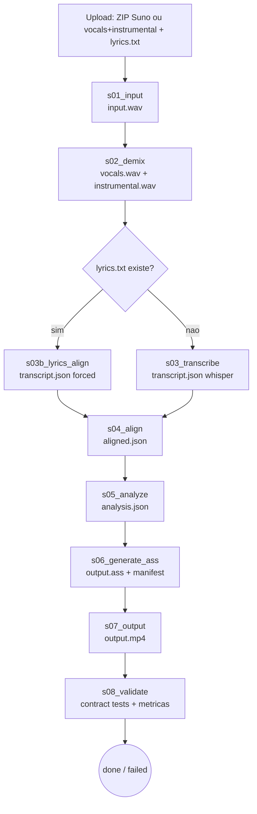
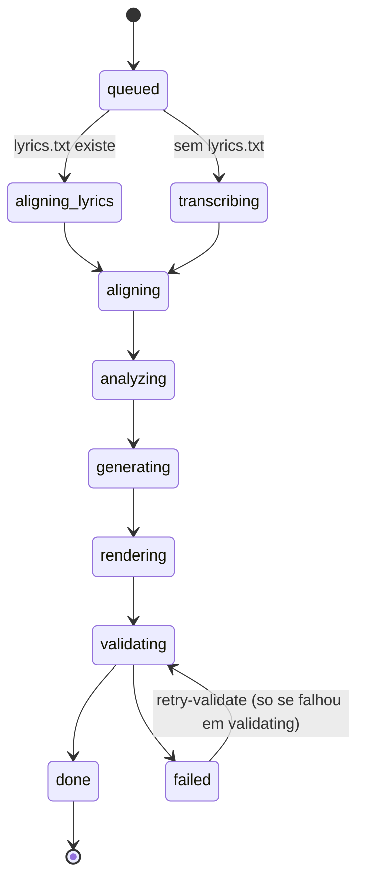
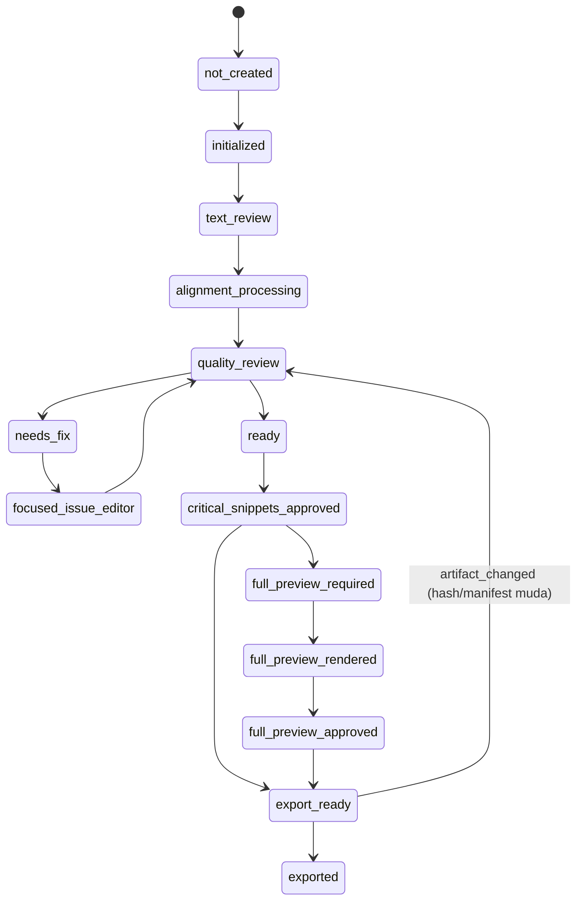
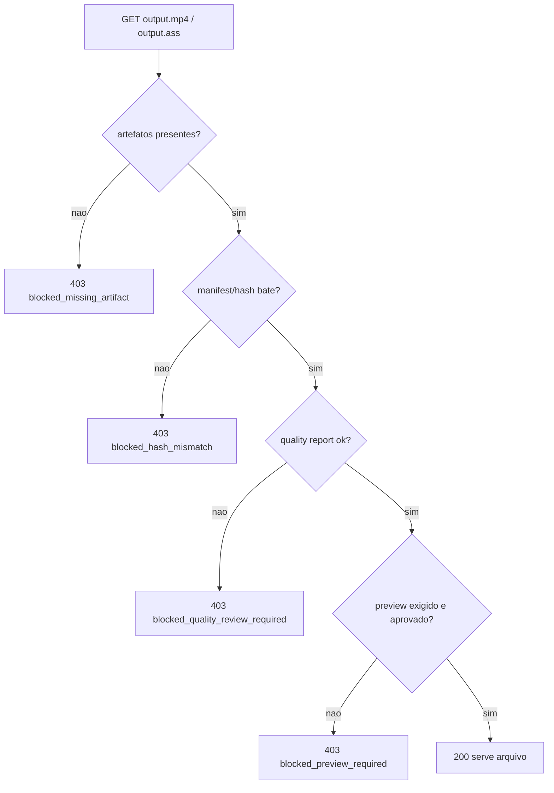

# Grafos

Diagramas Mermaid. Verdade textual em [SDD.md](SDD.md) e
[STATE_MACHINES.md](STATE_MACHINES.md); aqui é a visão.

## Pipeline (fluxo de estágios e artefatos)

## Ciclo de vida do job

## Review Wizard

## Export gate

