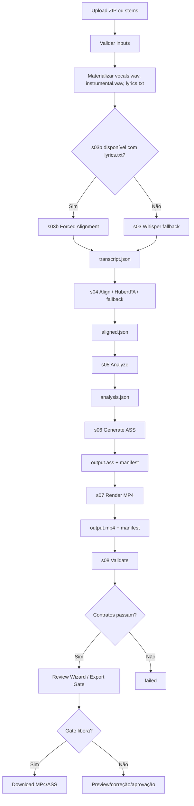
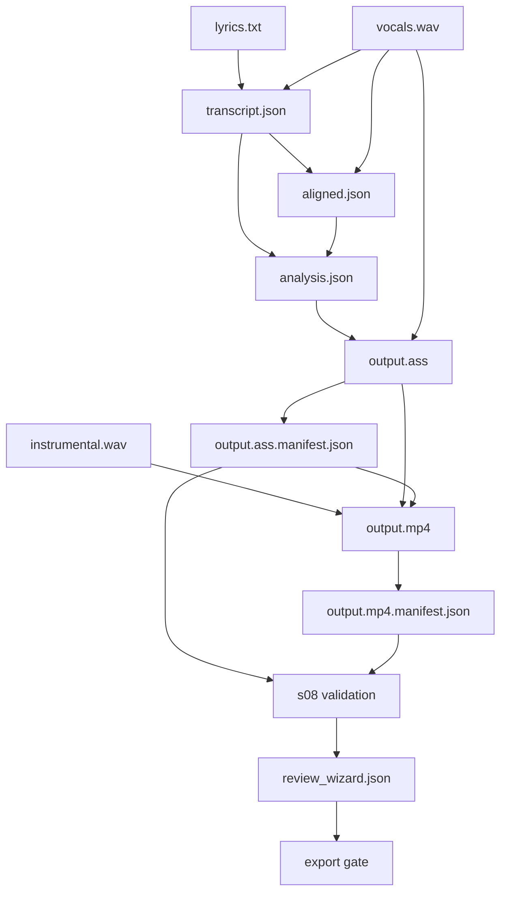
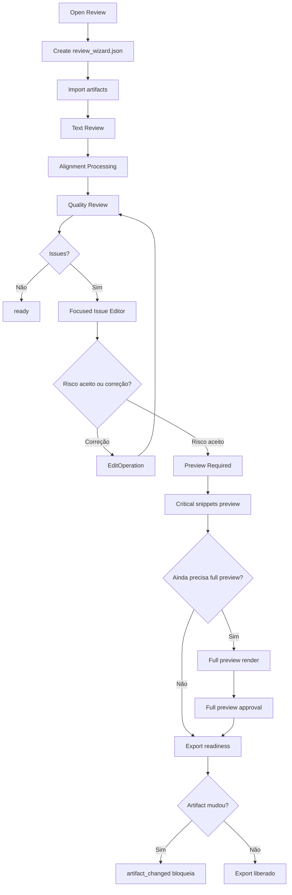

# GRAPHS — Karaoke MFA Multi

## 4.1 Contexto do sistema

```mermaid
flowchart LR
  User[Usuário local] --> UI[Flask UI]
  UI --> Upload[Upload Validator]
  UI --> Runner[Pipeline Runner]
  UI --> Review[Review Wizard]
  UI --> Gate[Export Gate]
  Runner --> JobDir[jobs/{job_id}]
  Review --> JobDir
  Gate --> JobDir
  Runner --> FFmpeg[ffmpeg]
  Runner --> Aligners[CTC/MMS + HubertFA]
  Runner --> Ollama[Ollama opcional]
  Runner --> StyleLib[Style Library]
  Gate --> MP4[output.mp4]
  Gate --> ASS[output.ass]
```

## 4.2 Pipeline principal



## 4.3 Artifact graph



## 4.4 Review Wizard


