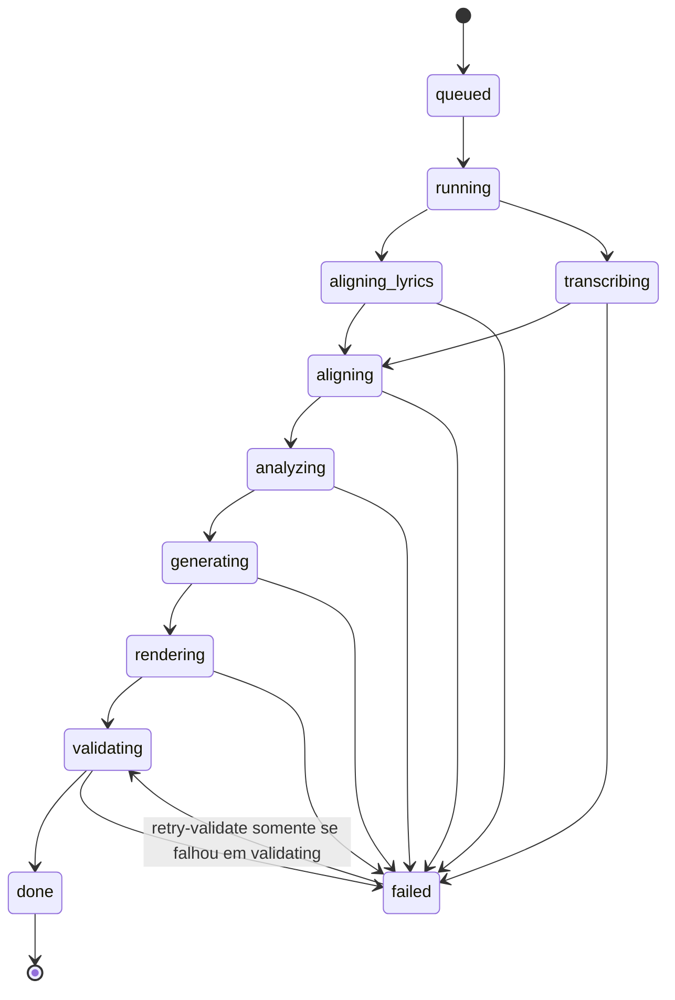
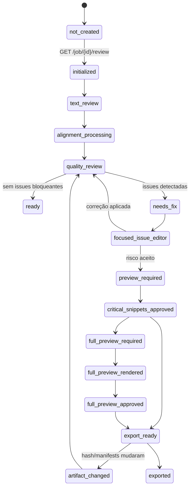
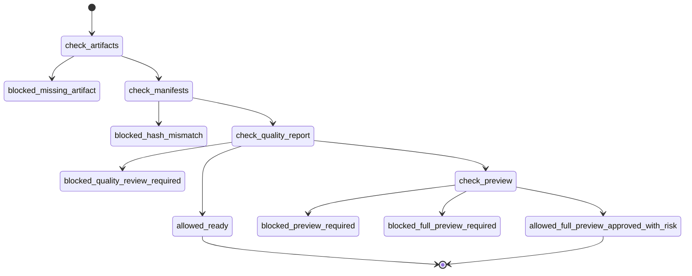
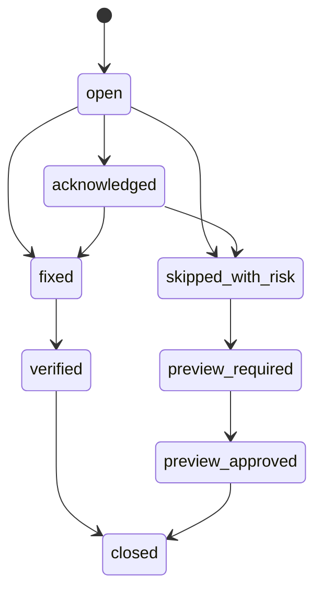

# STATE_MACHINES — Karaoke MFA Multi

## 11.1 Job lifecycle

```mermaid
stateDiagram-v2
  [*] --> queued
  queued --> running
  running --> aligning_lyrics
  running --> transcribing
  aligning_lyrics --> aligning
  transcribing --> aligning
  aligning --> analyzing
  analyzing --> generating
  generating --> rendering
  rendering --> validating
  validating --> done
  validating --> failed
  aligning_lyrics --> failed
  transcribing --> failed
  aligning --> failed
  analyzing --> failed
  generating --> failed
  rendering --> failed
  failed --> validating: retry-validate somente se falhou em validating
  done --> [*]
```

## 11.2 Review Wizard state machine

```mermaid
stateDiagram-v2
  [*] --> not_created
  not_created --> initialized: GET /job/{id}/review
  initialized --> text_review
  text_review --> alignment_processing
  alignment_processing --> quality_review
  quality_review --> ready: sem issues bloqueantes
  quality_review --> needs_fix: issues detectadas
  needs_fix --> focused_issue_editor
  focused_issue_editor --> quality_review: correção aplicada
  focused_issue_editor --> preview_required: risco aceito
  preview_required --> critical_snippets_approved
  critical_snippets_approved --> full_preview_required
  critical_snippets_approved --> export_ready
  full_preview_required --> full_preview_rendered
  full_preview_rendered --> full_preview_approved
  full_preview_approved --> export_ready
  export_ready --> artifact_changed: hash/manifests mudaram
  artifact_changed --> quality_review
  export_ready --> exported
```

## 11.3 Export gate state machine

```mermaid
stateDiagram-v2
  [*] --> check_artifacts
  check_artifacts --> blocked_missing_artifact
  check_artifacts --> check_manifests
  check_manifests --> blocked_hash_mismatch
  check_manifests --> check_quality_report
  check_quality_report --> blocked_quality_review_required
  check_quality_report --> allowed_ready
  check_quality_report --> check_preview
  check_preview --> blocked_preview_required
  check_preview --> blocked_full_preview_required
  check_preview --> allowed_full_preview_approved_with_risk
  allowed_ready --> [*]
  allowed_full_preview_approved_with_risk --> [*]
```

## 11.4 Issue lifecycle

```mermaid
stateDiagram-v2
  [*] --> open
  open --> acknowledged
  open --> fixed
  open --> skipped_with_risk
  acknowledged --> fixed
  acknowledged --> skipped_with_risk
  fixed --> verified
  skipped_with_risk --> preview_required
  preview_required --> preview_approved
  verified --> closed
  preview_approved --> closed
```
